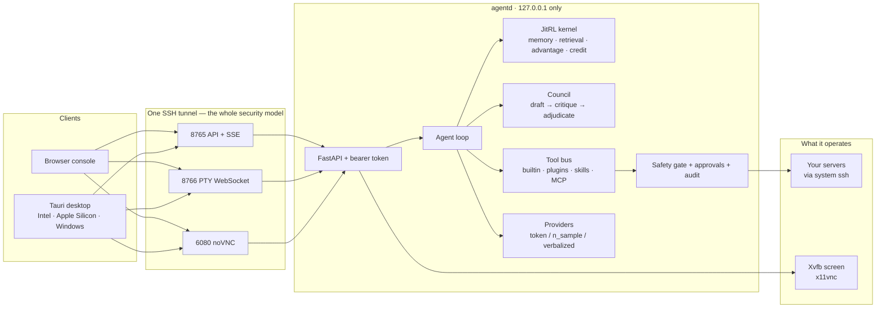

# agentd

**English** · [中文](README.zh-CN.md)

**agentd is a server agent that gets better as it works. No training, no GPU.**

Three things you can do with it:

1. **Put LLMs to work on your servers.** Point it at any model — an OpenAI-compatible
   endpoint (your own relay counts) or native Anthropic / Gemini. Models act through real
   tools: SSH, shell, files. Dangerous commands pass a safety gate and wait for your click.
2. **Watch it work.** A real interactive terminal, a live view of the machine's screen, and
   a step-by-step trace, all in one browser console. One SSH tunnel reaches it; the server
   exposes no public ports.
3. **Let it improve.** It records what each action earned and does better next time in
   similar situations. You can verify that mechanism yourself with no API key at all.

Pick your path:

- Want to run it now → [60 seconds](#60-seconds)
- Want the numbers → [Measured results](#measured-results)
- Want the mechanism → [How it works](#how-it-works)

It runs on a $5 VPS.

[](https://github.com/hue913/agentd/actions/workflows/ci.yml)


> Desktop client (Tauri, macOS Intel + Apple Silicon, Windows) plus the browser console
> served by the agent itself: **[hue913/council-agent](https://github.com/hue913/council-agent)**.

---

## 60 seconds

Install it, then two commands to watch it learn. No API key, no network.

```bash
git clone https://github.com/hue913/agentd && cd agentd
python3.11 -m venv .venv && . .venv/bin/activate
pip install -e ".[api]"

agentd demo                     # watch memory flip decisions, keyless
agentd bench --episodes 40      # success rate with and without memory
```

You will see two lines:

```
learning OFF (control)   1/40 (  2.5%)    1st half  5.0%   2nd half  0.0%
learning ON  (JitRL)    11/40 ( 27.5%)    1st half  0.0%   2nd half 55.0%
```

How to read it: without memory, the control arm wins 1 of 40 episodes. With memory, 11 —
and the second-half success rate climbs. That is the memory working. For results beyond a
single seed, see [Measured results](#measured-results).

## What it can do

| | |
|---|---|
| **Learns while running** | `(state, action, discounted_return)` triplets in SQLite; n-gram retrieval with an inverted index; advantage re-ranking; verbal self-critique stored and recalled. Per-memory credit accounting shows which memories actually get adopted |
| **Any model you want** | one `base_url + api_key + model` — an OpenAI-compatible endpoint or a native Anthropic / Gemini seat. Seats are managed live from the console or `POST /api/providers`; a capability probe picks the decode tier per endpoint; a missing key makes that seat abstain out loud, never fail silently |
| **Operates your servers** | SSH through the system `ssh`/`scp` (inherits `~/.ssh/config`, agent, `ProxyJump`), an interactive PTY terminal served over WebSocket, resumable uploads with md5 reconciliation |
| **An agent loop that acts** | open goals (`kind:"ops"`) run through the tool bus: the model proposes real calls — `ssh.exec {"host":"self","command":"df -h"}`, `ssh.exec df -h`, `finish {...}` — and every one passes the safety gate before execution |
| **You can see it work** | `Xvfb + x11vnc + noVNC` reached only through an SSH tunnel; the screen panel states plainly when no vision model is attached |
| **Refuses to destroy things** | every command is classified before execution; `rm -rf`, `mkfs`, `DROP TABLE`, force-push, `curl \| sh` etc. need a human approval, with the pending request showing command, reasons and host |
| **Multi-model councils** | independent proposals → cross-examination under a boundary → adjudication. Dissent is rendered as its own block and never averaged into a fake consensus |
| **Extensible four ways** | built-in tools, drop-in Python plugins, `SKILL.md` skill packs, and any MCP server — plus agentd itself is an MCP server |
| **Costs you less** | stable prompt prefix for provider-side caching, observation compaction, a per-step token ledger you can reconcile against your bill, cheap/strong tier routing |
| **Recurring work** | dependency-free cron evaluator (`agentd schedule`), with one-shot catch-up after downtime |
| **Shareable experience** | `agentd memory export` writes a signed `.agentdmem` pack and human-readable Markdown; import is idempotent and warns when provenance differs |

## Using it

### 1. Any model — three decode tiers

The council and the agent loop both need a score per candidate action. Not every endpoint
provides what scoring needs, so agentd probes the endpoint first and steps down
automatically:

| tier | endpoint gives | how the score is obtained |
|---|---|---|
| `token` | `logprobs` + `top_logprobs` | the probability of the decision token, exactly as in the paper's formula (see [How it works](#how-it-works)) |
| `n_sample` | logprob of the sampled token only | k independent samples; frequency becomes the score |
| `verbalized` | nothing | the model grades each option 0–100 |

```bash
agentd probe --base-url http://127.0.0.1:8080/v1 --model qwen3-8b
# → { "reachable": true, "decode_mode": "token", "notes": "top_logprobs at decision position …" }
```

The reference implementation reads a fixed token position (`logprobs.content[-2]`). If a
chat template emits a different number of trailing tokens — reasoning models do — that
position goes wrong. agentd locates the decision token every time, which is what makes
swapping models safe.

### 2. Hand it a server

Register a host, probe it, and route everything through one SSH tunnel:

```bash
agentd host add --label prod-1 --host 10.0.0.5 --user ops --key ~/.ssh/id_ed25519
agentd host probe --label prod-1        # arch / RAM / disk / docker / WebArena-viability, in one call
agentd viewer install                   # Xvfb + x11vnc + noVNC, loopback-only
agentd serve                            # HTTP API + SSE on 127.0.0.1:8765
```

API, PTY WebSocket and screen all travel through this one tunnel. The server exposes no
public ports besides 22:

```bash
ssh -N -L 8765:127.0.0.1:8765 -L 8766:127.0.0.1:8765 -L 6080:127.0.0.1:6080 root@your-server
# console   http://127.0.0.1:8765/
# screen    http://127.0.0.1:6080/vnc.html?autoconnect=true&resize=scale
```

### 3. The council: who sits at the table is yours

One model makes mistakes. Several models that draft, then challenge each other, make fewer.
Seats are not pinned to any vendor:

```bash
curl -X POST http://127.0.0.1:8765/api/providers -H "Authorization: Bearer $TOKEN" \
  -d '{"name":"lab","kind":"openai_compat","model":"qwen3-8b",
       "base_url":"https://your-relay.example/v1","api_key_env":"AGENTD_LAB_KEY","tier":"cheap"}'
```

Then run an open goal with the members you choose:

```json
POST /api/session
{ "task": "nginx 挂了该怎么排查", "kind": "ops", "council": true,
  "members": ["claude", "lab"], "max_steps": 12 }
```


The rules of the table:

* **Independent proposals first.** Every member scores the candidate actions on its own.
* **Cross-examination inside a boundary.** Members may only flag problems with someone
  else's proposal — never rewrite the plan. The critique phase sees prior output as
  untrusted input and cannot change tool permissions.
* **Learned trust.** Each member's weight is its historical win rate in states like this
  one. The council discovers that model A is right about nginx and model B is right about
  gitlab, instead of trusting the same vendor forever.
* **Dissent is kept.** Objections become risk rows (`object` / `split` / `unavailable`) and
  render as their own block. A seat whose key is missing abstains with a recorded reason;
  the outcome is visibly thinner, never quietly wrong.
* **Conditional by default.** Deliberation fires on a thin margin between the top two
  options, a dangerous action, or a task you pin. Confident steps cost one call.

### 4. Console & desktop client


There are two clients, and they are independent:

* **The browser console**: a single no-build bundle served by agentd itself at `/`. Open it
  in a browser over the SSH tunnel.
* **The desktop client** (Tauri, in the companion repo): a separate implementation that does
  not load this bundle — no UI code is shared between them today. It opens and supervises
  the SSH tunnel and adds tray presence.

Desktop builds: macOS universal (Intel + Apple Silicon) and Windows. Windows builds run via
GitHub Actions — Tauri cannot cross-compile a Windows bundle from a Mac.

→ **[hue913/council-agent](https://github.com/hue913/council-agent)**

### 5. Recurring work

Let the agent work on a schedule, with one automatic catch-up run after downtime:

```bash
agentd schedule add --name nightly-ops --cron "17 3 * * *" --task nginx-down
agentd schedule daemon
agentd run --suite web --policy model          # measure with your real endpoint
```

## Measured results

Every number below reproduces on your own laptop. Bench output labels which policy produced
the numbers, so the baseline and a real model never get mixed up.

| suite | policy | scale | memory OFF | memory ON | delta |
|---|---|---|---|---|---|
| ops (scripted chains) | synthetic noisy model | 40 eps × 12 seeds | mean 1.1/40 | mean 14.4/40 | better in 11/12 seeds |
| ops, default seed | same | 40 eps | 1/40 (2.5%) | 11/40 (27.5%) | 2nd half 55% |
| web (real Chromium) | lexical baseline (not an LLM) | 60 eps × 3 seeds | mean 18.7/60 | mean 23.7/60 | **+0.08, one seed negative** |

Reproduce the ops suite seed by seed:

```bash
for s in $(seq 1 12); do agentd bench --episodes 40 --seed $s | sed -n 3,4p; done
```

Three notes for reading the tables:

* The ops suite varies a lot across seeds (0 to 30). Read the trend: learning is better in
  11 of 12 seeds, and the twelfth is a tie where neither arm ever succeeds.
* The web suite drives actual Chromium through Playwright over six MiniWoB-shaped tasks
  (numbered elements, one goal, reward decided by a DOM checker on the page). Its gains are
  modest and seed-dependent; why, see [Honest limits](#honest-limits).
* Cross-machine reproducibility: a 2 vCPU Xeon deployment server (Ubuntu) reproduces the
  laptop's seed-7 numbers exactly (1/40 vs 11/40). The measurement is seed-deterministic,
  not machine-dependent.

**Deliberately not measured here:** full WebArena. The official shape is 4 vCPU / 16 GB /
1000 GB + 7 self-hosted sites; this project's reference box is a 2 GB VPS, so the web suite
above is the MiniWoB-shaped compromise. `agentd host probe` tells you in one command whether
your box could host the real thing.

Also from the live box (the exact deploy walkthrough is in [`docs/DEPLOY.md`](docs/DEPLOY.md)):


*The screen panel's capture path, unedited: Xvfb → x11vnc → agentd → JPEG, fetched through
the tunnel. What the model sees is what you see here.*

## How it works

### Why "without training" is the point

Deployed LLM weights are frozen, so the same mistakes repeat forever. Conventional RL fixes
that, but it costs two things a small box cannot pay: compute, and room for catastrophic
forgetting.

[**JitRL** (Just-In-Time Reinforcement Learning, arXiv:2601.18510)](https://arxiv.org/abs/2601.18510)
moves the RL to inference time: a dynamic, non-parametric memory of `<state, action, reward>`
triplets, retrieval of similar past trajectories, an on-the-fly advantage estimate, and a
direct additive modulation of the output logits. The paper proves this additive update is
the exact closed-form solution to the KL-constrained policy objective. On WebArena it beats
the strongest fine-tuning baseline (WebRL) without any training, at a thirtieth of the cost.

The core formula is one line:

```
z'(s,a) = z(s,a) + β·Â(s,a)
```

The model's own next-token score is z. agentd retrieves similar past situations, computes
the **advantage** Â for each option — how much that option tended to earn in situations like
this one — and adds it to z with a coefficient β. That is the whole learning: one table
lookup and one addition. No gradients, no fine-tuning.

The loop: `observe → enumerate/propose candidates → models score → kernel retrieves history
and biases → argmax → execute via the tool bus → record (state, action, return) → reflect`.

The end of each episode is Reflexion-shaped: the agent writes itself a two-sentence critique
tied to specific actions, stores it, and recalls it the next time a similar situation
appears.

### Where this implementation differs from the paper's

agentd is an independent, productised implementation of the JitRL idea, built for operators.
Where it deviates from the reference implementation:

* Retrieval is lexical: Jaccard n-grams over an inverted index, zero embedding calls. The
  paper uses a full BM25 + embedding + LLM-scored stack; this is a deliberate cheap subset,
  labelled as such.
* The advantage and exploration terms follow the published equations, including the
  "recompute-baseline" detail and the fixed ε=0.05 the published path actually uses.



Repo map:

```
src/agentd/
  kernel/      JitRL: store, retrieval, advantage, credit, memory packs
  providers/   openai_compat · anthropic (native) · gemini (native) · capability probe
  council.py   three-phase deliberation with learned member weights
  loop.py      the agent loop, Reflexion-style reflection
  envs/        scripted bench tasks · real tool tasks · web (MiniWoB) · SSH · PTY
  toolbus/     builtin tools · plugins · skills · MCP client
  safety/      command classification · audit log
  api/         HTTP + SSE + PTY WebSocket + console serving
  screen/      capture · change detection · perception · gated synthetic input
  sysinfo/     ops panel metrics (no request data ever reaches a shell)
ui/            the console, served same-origin by agentd
tests/         ~300 tests; platform-specific ones skip with a stated reason
```

## Deploy to a small VPS

```bash
# on the target, as root — installs uv + CPython 3.11, creates /opt/agentd/.venv,
# writes a 0600 config, runs doctor + the keyless demo, installs a hardened systemd unit
bash deploy/install_server.sh /path/to/agentd
```

The unit runs `agentd serve --host 127.0.0.1` and caps memory. It also drops
`AGENTD_AUTO_APPROVE` from the environment on purpose: the lab-only auto-approve switch can
never reach a deployed service. The full worked example — including the mistake (a briefly
public noVNC port, and the status check that now fails loudly instead of staying quiet) —
is in [`docs/DEPLOY.md`](docs/DEPLOY.md).

## Extending

```bash
# a tool in one file
cp examples/plugins/cert_days.py ~/.config/agentd/plugins/

# a skill pack: SKILL.md + scripts, loaded as tools
cp -r examples/skills/nginx-triage ~/.config/agentd/skills/

# agentd is also an MCP server for other agents
agentd mcp
```

Config lives in one file (`agentd.json`, 0600) plus environment variables. Keys are
referenced as `api_key_env`, so they stay in your systemd environment — not in the repo,
not in the browser.

## Security model, stated plainly

* **Loopback + tunnel.** agentd binds `127.0.0.1` and refuses non-loopback without an
  explicit `AGENTD_ALLOW_PUBLIC=1`. Remote reach is one `ssh -N -L`.
* **Fail-closed auth.** Protected routes require a bearer token; with no token configured
  they answer 503, not "open".
* **The gate decides, not the model.** Commands are classified before execution.
  Destructive intents need a human click that a disconnected socket can never auto-answer.
* **Audit without secrets.** The PTY records a rolling digest of what was typed — never the
  raw bytes. An append-only log is exactly where secrets would end up.
* **Honest failure everywhere.** Unreachable endpoint, missing key, refused command,
  blocked approval: each is rendered as itself. Nothing in this project fabricates a
  success.

## Honest limits

* The council's trust weights need a few hundred episodes before they mean anything; early
  runs are deliberately neutral (0.5).
* Lexical retrieval is weaker than the paper's embedded retriever on large memories. It is
  fast, free, dependency-zero, and labelled as a subset.
* The web-suite gains are small (see the table in [Measured results](#measured-results)).
  Why: the advantage term can only amplify successes the base policy occasionally reaches,
  and three of the six tasks are beyond the lexical baseline entirely. For benchmark-grade
  numbers, run `--policy model` with your own endpoint on real WebArena hardware.
* One agent, one box. There is no cluster mode, and agentd does not pretend to be a
  general-purpose coding agent. It operates servers, deliberately.

## Acknowledgments

**The paper this project exists because of.** agentd is an independent implementation of
[JitRL — *Just-In-Time Reinforcement Learning: Continual Learning in LLM Agents Without
Gradient Updates*](https://arxiv.org/abs/2601.18510) (arXiv:2601.18510, ICML 2026
Spotlight). Thank you to its authors — **Yibo Li, Zijie Lin, Ailin Deng, Xuan Zhang, Yufei
He, Shuo Ji, Tri Cao, and Bryan Hooi** — for the method, the theorems, and for publishing a
reference implementation ([liushiliushi/JitRL](https://github.com/liushiliushi/JitRL)) that
made it possible to check this codebase against the source of truth. No code from that
repository is included here; the attribution is for the method and the ideas.

**Borrowed ideas, credited:**

* **[open-project-council](https://github.com/hue913/open-project-council)** — the round-table
  protocol this project's council descends from: independent proposals, bounded critique,
  adjudication, and the insistence that unresolved dissent is shown, not averaged away.
* **[Reflexion](https://arxiv.org/abs/2303.11366)** (Shinn et al.) — verbal reinforcement via
  stored self-reflection, the training-free critique the loop performs at episode end.
* **[WebArena](https://arxiv.org/abs/2307.13854)** (Zhou et al.) — the evaluation philosophy
  of real environments and functional correctness; the web suite here is the small-box
  descendant of it.
* **[WebRL](https://arxiv.org/abs/2411.02337)** (Qi et al.) — the strongest fine-tuning
  baseline JitRL is measured against; its existence is why "training-free" is worth
  claiming.

**Standing on:** [xterm.js](https://xtermjs.org/) · [FastAPI](https://fastapi.tiangolo.com/)
· [uvicorn](https://www.uvicorn.org/) · [Playwright](https://playwright.dev/) ·
[Xvfb / x11vnc / noVNC](https://novnc.com/) · [Tauri](https://tauri.app/) ·
[SQLite](https://sqlite.org/).

## License

[Apache-2.0](LICENSE). The artefacts you build with it are yours; credentials never enter
the repo, and the audit trail is designed not to accumulate secrets.

---

*If this project is useful to you, the best thanks are a star, an issue with your setup, and
a bench run against your own model — those numbers are the ones worth having.*
