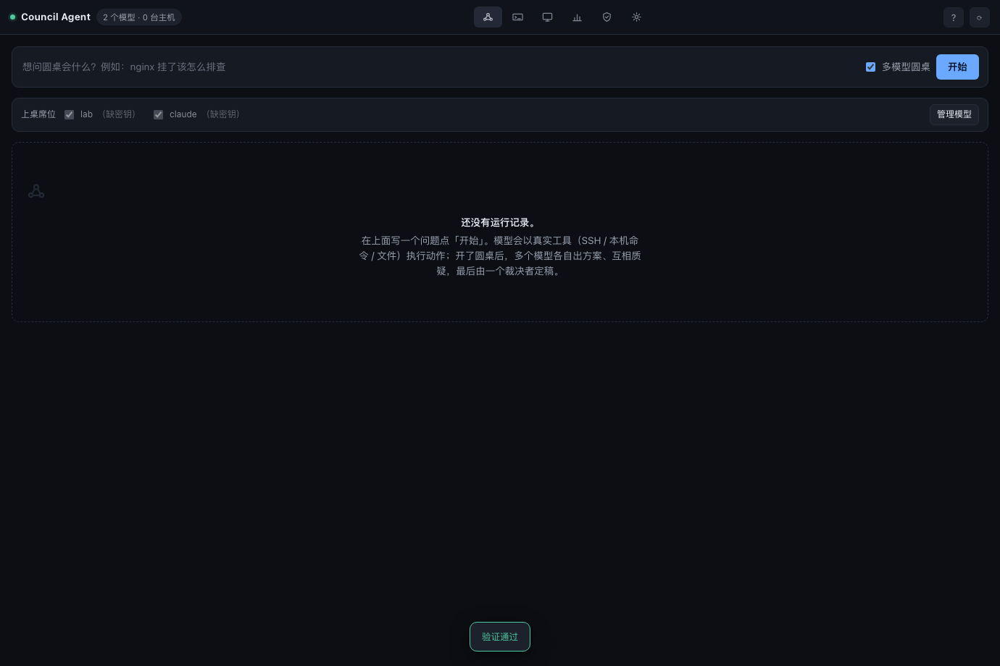
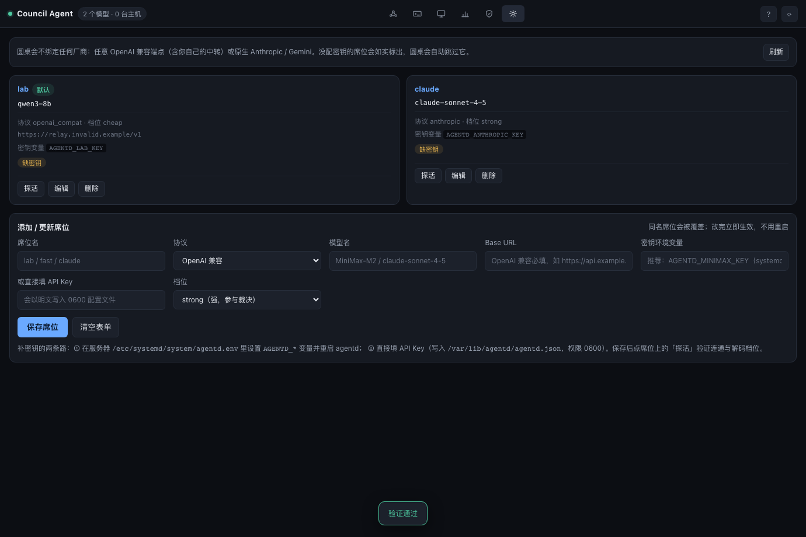
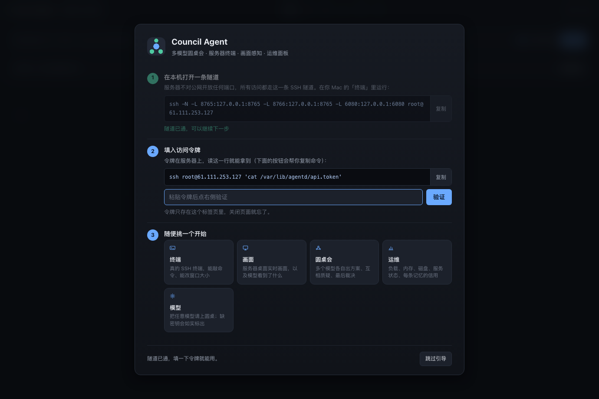
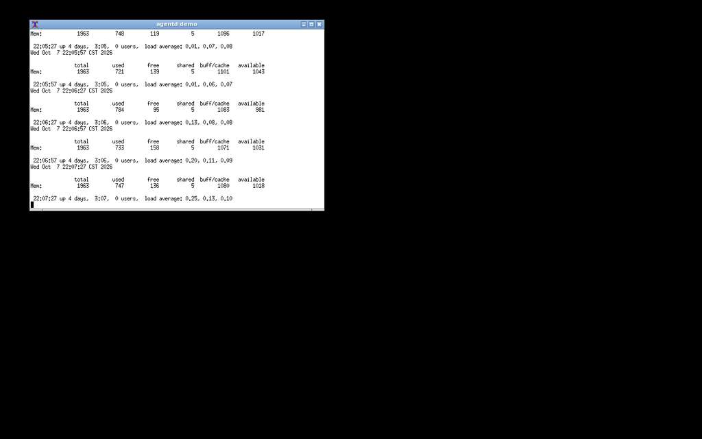
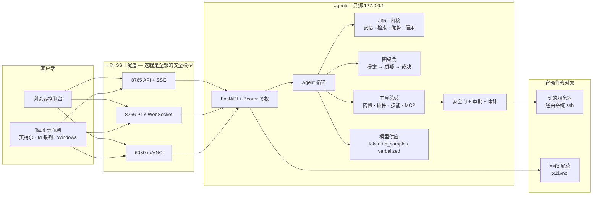

# agentd

[English](README.md) · **中文**

**agentd 是一个自己越用越好的服务器 Agent。不用训练，不用 GPU。**

你能拿它做三件事：

1. **让大模型替你操作服务器。** 接任意模型——OpenAI 兼容端点（自建中转也算）或原生
   Anthropic / Gemini。模型通过真实工具干活：SSH、本机命令、文件。危险命令先过安全门，
   等你点头才执行。
2. **看住它干活。** 真交互终端、服务器实时画面、每一步的执行轨迹，都在一个浏览器控制台里。
   一条 SSH 隧道就能访问，服务器不对公网开任何端口。
3. **让它越用越好。** 它记下每次行动的成败，下次遇到相似局面会做得更好。这套机制不需要
   API Key 就能亲手验证。

三条路，按需取用：

- 想马上跑起来 → 「[60 秒上手](#60-秒上手)」
- 想看实测数字 → 「[实测数字](#实测数字)」
- 想懂原理 → 「[它是怎么工作的](#它是怎么工作的)」

它能跑在一台 5 美元的 VPS 上。

[](https://github.com/hue913/agentd/actions/workflows/ci.yml)
[](https://github.com/hue913/agentd/actions/workflows/release-desktop.yml)




> Tauri 桌面端和浏览器控制台现在都在这个仓库里：同一个项目、同一个 API、同一份可审计轨迹。

---

## 60 秒上手

装好它，然后两条命令看它学习。不需要 API Key，不需要联网。

```bash
git clone https://github.com/hue913/agentd && cd agentd
python3.11 -m venv .venv && . .venv/bin/activate
pip install -e ".[api]"

agentd demo                     # 看记忆如何改写决策，全程离线
agentd bench --episodes 40      # 对比有记忆和没记忆的胜率
```

你会看到两行输出：

```
learning OFF (control)   1/40 (  2.5%)    1st half  5.0%   2nd half  0.0%
learning ON  (JitRL)    11/40 ( 27.5%)    1st half  0.0%   2nd half 55.0%
```

怎么读：关掉记忆的对照组 40 局只赢 1 局。打开记忆后赢 11 局，而且后半段胜率明显上升——
记忆在起作用。想看不只一个种子的结果，翻到「实测数字」。

## 它能做什么

| | |
|---|---|
| **边跑边学** | SQLite 里的 `(状态, 动作, 折扣回报)` 三元组；倒排索引上的 n-gram 检索；优势重排；言语式自我复盘；每条记忆带信用账（被采纳 / 被否决），能看出"哪条经验真的有用" |
| **接你想接的任何模型** | 一组 `base_url + api_key + model`——任意 OpenAI 兼容端点或原生 Anthropic / Gemini 席位。席位可在控制台或 `POST /api/providers` 里增删改查；能力探测自动决定解码档位；缺 Key 的席位会当众弃权，绝不悄悄失败 |
| **真的在操作你的服务器** | 走系统 `ssh`/`scp`（继承 `~/.ssh/config`、agent、`ProxyJump`）；WebSocket 上的交互式 PTY 终端；带 md5 对账的可断点续传 |
| **会动手的 Agent 循环** | 开放目标（`kind:"ops"`）走工具总线：模型提议真实调用——`ssh.exec {"host":"self","command":"df -h"}`、`ssh.exec df -h`、`finish {...}`——每一个都先过安全门再执行 |
| **看得见它在干活** | `Xvfb + x11vnc + noVNC`，只经 SSH 隧道可达；没有接入视觉模型时，屏幕面板会明说"未接视觉" |
| **拒绝破坏** | 每条命令执行前先分类；`rm -rf`、`mkfs`、`DROP TABLE`、强推、`curl \| sh` 都要人工批准，待批卡片给出命令、原因与主机 |
| **多模型圆桌会** | 独立提案 → 有边界的互相质疑 → 裁决。分歧独立成块展示，永不折叠成"已达成共识" |
| **四种扩展方式** | 内置工具、即插即用的 Python 插件、`SKILL.md` 技能包、任意 MCP 服务器——而且 agentd 本身就是一个 MCP 服务器 |
| **更省** | 稳定前缀吃满上游缓存、观测压缩、逐步 token 账本可与账单对账、cheap/strong 分档路由 |
| **例行工作** | 零依赖 cron 求值器（`agentd schedule`），宕机后一次性补跑 |
| **可分享的经验** | `agentd memory export` 写出签名 `.agentdmem` 包和人类可读的 Markdown；导入幂等，来源不符时明确警告 |

## 用起来

### 1. 接任何模型——三档解码

圆桌会和 Agent 循环都要给每个候选动作打分。不是所有端点都提供打分需要的信息，所以
agentd 先探测端点能力，再自动降档：

| 档位 | 端点提供 | 分数的来源 |
|---|---|---|
| `token` | `logprobs` + `top_logprobs` | 直接读决策 token 的概率，与论文公式一致（见「它是怎么工作的」） |
| `n_sample` | 只有被采样 token 的 logprob | 独立采样 k 次，频率即分数 |
| `verbalized` | 什么都给不了 | 模型给每个选项 0–100 打分 |

```bash
agentd probe --base-url http://127.0.0.1:8080/v1 --model qwen3-8b
# → { "reachable": true, "decode_mode": "token", "notes": "top_logprobs at decision position …" }
```

参考实现固定读倒数第二个 token。聊天模板的尾部 token 数一变（推理模型就会变），它就读错
位置。agentd 每次都实际找到决策 token 的位置，所以换模型是安全的。

### 2. 让它管一台服务器

一条命令登记主机，一条命令体检，然后所有访问都收进一条 SSH 隧道：

```bash
agentd host add --label prod-1 --host 10.0.0.5 --user ops --key ~/.ssh/id_ed25519
agentd host probe --label prod-1        # 一条命令给出架构 / 内存 / 磁盘 / Docker / WebArena 可行性
agentd viewer install                   # Xvfb + x11vnc + noVNC，只绑本机回环
agentd serve                            # HTTP API + SSE，仅监听 127.0.0.1:8765
```

API、PTY WebSocket、画面，全都走下面这一条隧道。服务器上除了 22 端口不暴露任何东西：

```bash
ssh -N -L 8765:127.0.0.1:8765 -L 8766:127.0.0.1:8765 -L 6080:127.0.0.1:6080 root@你的服务器
# 控制台  http://127.0.0.1:8765/
# 画面    http://127.0.0.1:6080/vnc.html?autoconnect=true&resize=scale
```

### 3. 圆桌会：谁上桌，你说了算

一个模型会犯错。多个模型先各自提案、再互相挑错，错会少一些。席位不绑定任何厂商：

```bash
curl -X POST http://127.0.0.1:8765/api/providers -H "Authorization: Bearer $TOKEN" \
  -d '{"name":"lab","kind":"openai_compat","model":"qwen3-8b",
       "base_url":"https://你的中转.example/v1","api_key_env":"AGENTD_LAB_KEY","tier":"cheap"}'
```

然后用你点名的成员跑一个开放目标：

```json
POST /api/session
{ "task": "nginx 挂了该怎么排查", "kind": "ops", "council": true,
  "members": ["claude", "lab"], "max_steps": 12 }
```



圆桌会的规则：

* **先各自独立提案。** 每个成员独立给候选动作打分。
* **在边界内互相质疑。** 成员只能指出别人方案的问题，不能重写方案。质疑阶段看到的前序
  输出一律视为不可信输入，也无法改变工具权限。
* **会学习的信任度。** 每个成员的权重是它在这类状态里的历史胜率。议会会发现"关于 nginx，
  A 模型说得对；关于 gitlab，B 模型说得对"，而不是永远迷信同一个厂商。
* **分歧保留。** 反对意见变成风险行（`object` / `split` / `unavailable`），独立成块渲染。
  缺 Key 的席位带着原因弃权；结果是可见地更单薄，而不是悄悄变错。
* **默认按需触发。** 前两名分差过小、动作危险、或你钉住的任务才会开会。有把握的步骤只花
  一次调用。

### 4. 控制台与桌面客户端



客户端有两个入口，但共用同一个 agentd 运行时：

* **浏览器控制台**：一份无构建的单页 bundle，由 agentd 自己伺服在 `/`。通过 SSH 隧道在
  浏览器里打开即可。
* **桌面客户端**（Tauri，位于 `desktop/`）：加载同一份 bundle，负责打开并守护 SSH 隧道，
  将桥接凭据放进系统钥匙串，并管理原生窗口生命周期。

桌面客户端的构建目标：macOS 通用包（英特尔 + M 系列）与 Windows。Windows 包走 GitHub
Actions——Tauri 无法从 Mac 交叉编译 Windows 包。

可以在 `desktop/src-tauri` 本地构建，也可以从
[agentd Releases](https://github.com/hue913/agentd/releases) 下载 macOS 和 Windows 安装包。

### 5. 可审计运行与浏览器任务

每次运行都能通过 `/api/session/{id}/trajectory` 回放；提案、异议、裁决、审批、观察、奖励
和反思都写入同一个 SQLite。可选浏览器 runner 复用 MiniWoB/WebArena 风格环境，没有页面检查器
返回成功就不会伪造成功。用 `/api/browser/tasks` 查看内置安全任务；内存较小的服务器应关闭 Playwright。

任务模板和可选 JEV 决策模型分别通过 `/api/task-templates`、`/api/decision-model` 配置。JEV
只能从候选动作里选择，不能改变安全门或审批边界。

### 6. 例行工作

让 Agent 定时干活，宕机后自动补跑一次：

```bash
agentd schedule add --name nightly-ops --cron "17 3 * * *" --task nginx-down
agentd schedule daemon
agentd run --suite web --policy model          # 用你的真实端点做一次测量
```

## 实测数字

每个数字都能在你自己的笔记本上复现。bench 输出里标注了产生数字的策略名，基线和模型
不会混。

| 套件 | 策略 | 规模 | memory OFF | memory ON | 差值 |
|---|---|---|---|---|---|
| ops（脚本链） | 合成含噪模型 | 40 局 × 12 种子 | 均值 1.1/40 | 均值 14.4/40 | 11/12 种子更好 |
| ops，默认种子 | 同上 | 40 局 | 1/40 (2.5%) | 11/40 (27.5%) | 后半段 55% |
| web（真实 Chromium） | 词汇基线（不是 LLM） | 60 局 × 3 种子 | 均值 18.7/60 | 均值 23.7/60 | **+0.08，一个种子为负** |

逐种子复现 ops 套件：

```bash
for s in $(seq 1 12); do agentd bench --episodes 40 --seed $s | sed -n 3,4p; done
```

读表注意三点：

* ops 套件种子间波动很大（0 到 30）。结论看趋势：12 个种子里 11 个学习组更好，剩下的
  1 个双方都没成功过。
* web 套件用 Playwright 驱动真实 Chromium，跑六个 MiniWoB 形状的任务（带编号的元素、
  单一目标、奖励由页面上的 DOM 检查器判定）。这一行的增益温和且依赖种子，原因见
  「诚实的边界」。
* 跨机器可复现：一台 2 vCPU 至强、Ubuntu 的部署服务器跑出与笔记本完全一致的 seed-7
  数字（1/40 vs 11/40）。测量由种子决定，不依赖机器。

**刻意没测的：**完整的 WebArena。它的官方形态是 4 vCPU / 16 GB / 1000 GB 磁盘 + 7 个
自托管站点；本项目的参考机器是一台 2 GB 的 VPS，所以 web 套件是 MiniWoB 形状的折中。
`agentd host probe` 会用一条命令告诉你，你的机器能不能扛真正的 WebArena。

来自实机部署的一帧（完整部署实录见 [`docs/DEPLOY.md`](docs/DEPLOY.md)）：



*屏幕面板的抓帧链路，未经修饰：Xvfb → x11vnc → agentd → JPEG，经隧道取回。模型看到的，
就是你在这里看到的。*

## 它是怎么工作的

### 为什么"不用训练"是重点

部署后的 LLM 权重是冻结的，同一个错误会永远重复下去。传统强化学习能改这一点，但需要
两样小机器付不起的东西：算力，以及承受灾难性遗忘的余地。

[**JitRL**（Just-In-Time Reinforcement Learning，arXiv:2601.18510）](https://arxiv.org/abs/2601.18510)
把强化学习搬到了推理时：一个动态的非参数记忆库（`<状态, 动作, 回报>` 三元组）、相似
历史轨迹的检索、即时的优势估计，以及对输出 logits 的直接加法调制。论文证明了这条加法
更新正是 KL 约束策略优化目标的精确闭式解。它在 WebArena 上完全不训练就超过了做微调的
最强基线（WebRL），成本只有后者的三十分之一。

核心公式只有一行：

```
z'(s,a) = z(s,a) + β·Â(s,a)
```

模型自己给出的下一个 token 的分数是 z。agentd 检索相似的历史局面，算出每个选项的
**优势值** ——过去这类局面里哪个选项赚得多——再按系数 β 加到 z 上。这就是全部的学习：
一次查表，一次加法。没有梯度下降，没有微调。

循环本体：`观测 → 枚举/提议候选 → 模型打分 → 内核检索历史并偏置 → 取最大 → 经工具总线
执行 → 记 (状态, 动作, 回报) → 复盘`。

循环的收尾是 Reflexion 形态：一局结束后，Agent 给自己写两句具体到动作的复盘，存起来，
下次遇到相似局面时召回。

### 与论文参考实现的差异

agentd 是 JitRL 思想的独立产品化实现，面向运维者。与参考实现不同的地方：

* 检索是词汇级的：Jaccard n-gram + 倒排索引，零嵌入调用。论文用 BM25 + 嵌入 + LLM 评分
  的完整栈，这里取其廉价子集，并如实标注。
* 优势与探索项遵循已发布公式，包括"重算基线"的细节和发布路径里实际使用的固定 ε=0.05。



仓库地图：

```
src/agentd/
  kernel/      JitRL：存储、检索、优势、信用、记忆包
  providers/   OpenAI 兼容 · Anthropic 原生 · Gemini 原生 · 能力探测
  council.py   三阶段圆桌会，带会学习的成员权重
  loop.py       Agent 循环与 Reflexion 式复盘
  envs/         脚本基准任务 · 真实工具任务 · 网页(MiniWoB) · SSH · PTY
  toolbus/      内置工具 · 插件 · 技能 · MCP 客户端
  safety/       命令分类 · 审计日志
  api/          HTTP + SSE + PTY WebSocket + 控制台托管
  screen/       抓帧 · 变化检测 · 感知 · 有门的合成输入
  sysinfo/      运维面板指标（请求数据永远不会碰到 shell）
ui/            控制台——由 agentd 同源托管
tests/         约 300 个测试；平台相关的用例带着原因跳过，绝不假装通过
```

## 部署到一台小 VPS

```bash
# 在目标机上以 root 运行——装 uv + CPython 3.11、建 /opt/agentd/.venv、
# 写 0600 配置、跑 doctor 与无钥演示、安装加固过的 systemd 单元
bash deploy/install_server.sh /path/to/agentd
```

systemd 单元以 `--host 127.0.0.1` 运行，限制内存上限，并且故意从环境里剔除
`AGENTD_AUTO_APPROVE`。那个实验室专用的自动批准开关，永远到不了线上服务。
完整实录——包括那次错误（noVNC 短暂暴露公网，以及现在会大声报错而不是保持沉默的状态
检查）——在 [`docs/DEPLOY.md`](docs/DEPLOY.md) 里。

## 扩展

```bash
# 一个文件就是一个工具
cp examples/plugins/cert_days.py ~/.config/agentd/plugins/

# 技能包：SKILL.md + 脚本，直接变成工具
cp -r examples/skills/nginx-triage ~/.config/agentd/skills/

# agentd 同时也是一个给别的 Agent 用的 MCP 服务器
agentd mcp
```

配置只有一份（`agentd.json`，0600）加环境变量。密钥一律用 `api_key_env` 引用，住在你的
systemd 环境里，不进仓库，也不进浏览器。

## 安全模型，明明白白

* **回环 + 隧道。** agentd 只绑 `127.0.0.1`。没有显式 `AGENTD_ALLOW_PUBLIC=1`，它拒绝
  绑定非回环地址。远程可达性等于一条 `ssh -N -L`。
* **失败关死。** 受保护路由需要 Bearer token。没配置 token 时返回 503，而不是敞开。
* **由安全门做决定，不是模型。** 命令在执行之前被分类。破坏性意图需要一次人工点击，而
  断开的连接永远无法自动补上这一击。
* **审计里没有秘密。** PTY 记录的是输入内容的滚动摘要（digest），永远不是原始字节。
  追加式日志正是秘密最容易堆积的地方。
* **处处诚实失败。** 端点不可达、缺 Key、命令被拒、审批被断：每一样都以它本来的样子
  呈现。这个项目里没有任何一处伪造成功。

## 诚实的边界

* 圆桌会的信任权重需要几百局才有意义；早期运行刻意保持中性（0.5）。
* 词汇检索在大记忆库上弱于论文的嵌入检索。它快、免费、零依赖，并且被明确标注为子集。
* 网页套件的增益很小（见「实测数字」的表）。原因：优势项只能放大基线策略偶尔能撞到的
  成功，而六个任务里有三个对词汇基线完全无解。要基准级的数字，请用自己的端点跑
  `--policy model`，上真 WebArena 硬件。
* 单机单 Agent。没有集群模式；agentd 也不假装自己是通用编程 Agent——它操作服务器，
  这是有意为之。

## 致谢

**这个项目因这篇论文而存在。** agentd 是
[JitRL ——《Just-In-Time Reinforcement Learning: Continual Learning in LLM Agents Without Gradient Updates》](https://arxiv.org/abs/2601.18510)
（arXiv:2601.18510，ICML 2026 Spotlight）的独立实现。感谢论文作者
——**Yibo Li、Zijie Lin、Ailin Deng、Xuan Zhang、Yufei He、Shuo Ji、Tri Cao、Bryan Hooi**
——感谢方法、感谢定理，也感谢公开了参考实现
（[liushiliushi/JitRL](https://github.com/liushiliushi/JitRL)），
让这份代码可以对着源头逐条核对。本仓库未包含该仓库的任何代码；
这份署名献给方法与思想本身。

**借鉴并署名的思想：**

* **[open-project-council](https://github.com/hue913/open-project-council)** ——本项目的
  圆桌会脱胎于它的议事协议：独立提案、有边界的质疑、裁决，以及那条坚持——未消解的
  分歧必须展示，不许被平均掉。
* **[Reflexion](https://arxiv.org/abs/2303.11366)**（Shinn 等）——言语式强化：把自我
  反思存下来，在下一次尝试里召回；循环结束时的复盘正源于此。
* **[WebArena](https://arxiv.org/abs/2307.13854)**（Zhou 等）——真实环境 + 功能正确性的
  评测哲学；这里的网页套件是它在小机器上的后代。
* **[WebRL](https://arxiv.org/abs/2411.02337)**（Qi 等）——JitRL 对标的最强微调基线；
  正因为有它，"免训练"才是个值得主张的说法。

**脚下的巨人：**[xterm.js](https://xtermjs.org/) ·
[FastAPI](https://fastapi.tiangolo.com/) · [uvicorn](https://www.uvicorn.org/) ·
[Playwright](https://playwright.dev/) · [Xvfb / x11vnc / noVNC](https://novnc.com/) ·
[Tauri](https://tauri.app/) · [SQLite](https://sqlite.org/)。

## 许可

[Apache-2.0](LICENSE)。用它构建出来的产物归你；凭据不进仓库，审计轨迹在设计上就不积累
秘密。

---

*如果这个项目对你有用：点颗星、开个 Issue 说说你的环境、或者用你自己的模型跑一次
bench——后面这种数字，才是真正值得拥有的。*
